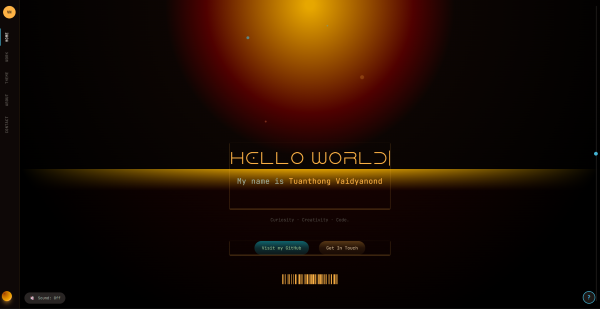
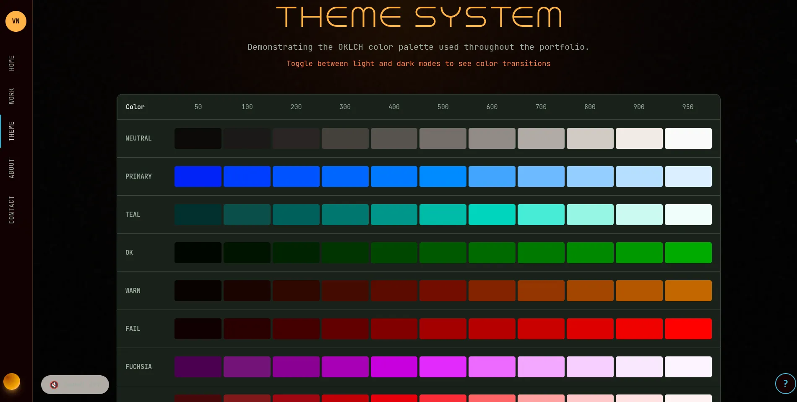

# Zenfolio - Interactive MERN Stack Portfolio

A high-end interactive portfolio website with cinematic animations, terminal-inspired aesthetics, and sophisticated UI/UX. Built as a full-stack MERN application with enterprise-grade security and production-ready architecture.

**Status**: V2 Complete - Security hardened, production-ready core

## Why This Project Exists

This project was built to explore:

- Advanced UI/UX patterns beyond standard portfolios
- AI-assisted development workflows using structured prompting
- Scalable frontend architecture with reusable primitives
- Production-grade security implementation
- Real-time iteration and refactoring practices

It serves as both:

1. A portfolio
2. A documented learning system
3. A production-ready template

## Quick Start

```bash
# Install all dependencies
npm install

# Frontend (Port 5173)
cd client && npm run dev

# Backend (Port 5000)
cd server && npm run dev
```

## AI-Assisted Development

- Prompt engineering stored in structured `.md` files
- Iterative UI refinement using LLM feedback loops
- Documentation generated and refactored using AI agents
- Decision tracking through prompt history

See `/docs` for full evolution.

## Core Technologies

| Layer              | Technology               |
| ------------------ | ------------------------ |
| Frontend Framework | React 19                 |
| Build Tool         | Vite                     |
| Styling            | Tailwind CSS v4          |
| Animation          | Framer Motion v12        |
| Routing            | React Router v7          |
| Smooth Scroll      | Lenis v1.3               |
| Backend            | Express.js v5 + Mongoose |
| Database           | MongoDB                  |
| Security           | Helmet, CORS, Rate Limiting, Validation |
| Logging            | Morgan                   |

## Security Features

### Production-Grade Security (V2 Implementation)

**Authentication & Authorization**
- JWT-based authentication with bcrypt password hashing
- Role-based access control (RBAC) - user/admin roles
- JWT tokens include user ID and role in payload
- Protected routes with `protect` middleware
- Admin-only routes with `adminOnly` middleware

**Input Validation**
- `express-validator` on all POST/PUT endpoints
- Email format validation and normalization
- Password complexity (8+ chars, upper/lower/number)
- XSS sanitization via `.escape()` on text fields
- Length limits (name: 2-100, message: 10-1000, title: 3-100, description: 10-500)
- Role escalation prevention (role restricted to "user" on registration)

**Rate Limiting**
- Authentication endpoints: 5 requests per 15 minutes (brute force protection)
- Contact form: 3 submissions per hour (spam prevention)
- General API: 100 requests per 15 minutes
- Returns standard `RateLimit-*` headers

**Security Headers (Helmet.js)**
- X-Content-Type-Options: nosniff
- X-Frame-Options: DENY (clickjacking protection)
- X-XSS-Protection
- Content-Security-Policy
- And 10+ other security headers

**CORS Configuration**
- Restricted to `CLIENT_URL` environment variable
- Credentials enabled for authentication cookies
- No open CORS in production

**Error Handling**
- Centralized error handling middleware (no stack traces in production)
- Mongoose validation error handling
- Duplicate key error handling (MongoDB unique constraints)
- JWT error handling (invalid/expired tokens)
- 404 handler for undefined routes

**Request Logging**
- Morgan request logging for audit trail
- All requests logged with method, path, status code, response time

## API Endpoints

### Public Endpoints

| Method | Endpoint              | Description                          | Rate Limit         |
| ------ | --------------------- | ------------------------------------ | ------------------ |
| GET    | `/api/projects`       | Get all projects (with filters)      | 100 req / 15 min   |
| GET    | `/api/projects/:id`   | Get single project by ID             | 100 req / 15 min   |
| POST   | `/api/contact`        | Submit contact form                  | 3 req / 1 hour     |
| POST   | `/api/users/register` | Register new user                    | 5 req / 15 min     |
| POST   | `/api/users/login`    | User login                           | 5 req / 15 min     |

**Query Parameters for `/api/projects`:**
- `?category=Frontend` - Filter by category
- `?featured=true` - Show only featured projects

### Protected Endpoints (Authentication Required)

| Method | Endpoint             | Description                          |
| ------ | -------------------- | ------------------------------------ |
| GET    | `/api/users/profile` | Get current user profile             |

### Admin Only Endpoints

| Method | Endpoint                | Description                          |
| ------ | ----------------------- | ------------------------------------ |
| POST   | `/api/projects`         | Create new project                   |
| PUT    | `/api/projects/:id`     | Update existing project              |
| DELETE | `/api/projects/:id`     | Delete project                       |
| GET    | `/api/contact/messages` | Get all contact messages             |
| PATCH  | `/api/contact/:id/read` | Mark message as read/unread          |
| DELETE | `/api/contact/:id`      | Delete contact message               |
| GET    | `/api/users`            | Get all registered users             |

**Authentication Header:**
```
Authorization: Bearer <jwt_token>
```

## Preview




## Key Features

### Visual System

- Terminal loader with ASCII art
- SVG text animations
- Custom cursor with trails
- 3D tilt effects
- Warm amber "Midnight Sun" background

### Navigation

- Vertical sidebar with vertical text
- Custom scrollbar with range input
- 3D page transitions

### Interactive Elements

- Mini terminal easter eggs (whoami, chef, journalist, skills)
- Hidden commands (matrix, sudo, coffee)
- Konami code detection
- Career timeline with scroll-triggered SVG path
- Filterable project grid with stat counters
- Terminal-styled contact form with database persistence
- **Authentication system** with terminal-styled login UI
- **Admin dashboard** with CRUD interface for projects and messages

### Authentication System

- JWT-based authentication with bcrypt password hashing
- Terminal-styled login/register forms with animations
- Protected admin routes with role-based access control
- Admin dashboard for managing projects, messages, and users
- LocalStorage persistence with reactive state updates
- Server-side token validation
- Auto-redirect to login for protected routes

### Contact Form Persistence

- Contact form submissions saved to MongoDB
- Admin can view, mark as read/unread, and delete messages
- Sorted by unread first, then by date
- Full CRUD operations via admin dashboard

### Project Management

- Projects stored in MongoDB (not hardcoded)
- Full CRUD operations (Create, Read, Update, Delete)
- Filtering by category and featured status
- Admin dashboard with modal interface for management

## Project Structure

```
/
├── client/              # React SPA (Port 5173)
│   ├── src/
│   │   ├── components/  # UI components (Hero, Navbar, Terminal, etc.)
│   │   ├── pages/       # Route pages (Home, About, Work, Contact, Admin)
│   │   ├── hooks/       # Custom hooks (use3DTilt, useTerminalOutput, etc.)
│   │   ├── styles/      # Tailwind v4 + Design Tokens
│   │   ├── services/    # API services (api.js)
│   │   ├── context/     # React Context (AuthProvider, etc.)
│   │   └── utils/       # Utilities (motionPresets.js)
│   └── public/
├── server/              # Express API (Port 5000)
│   ├── src/
│   │   ├── config/      # Database & environment config
│   │   ├── models/      # Mongoose schemas (User, Project, ContactMessage)
│   │   ├── controllers/ # Route handlers (user, project, contact)
│   │   ├── middleware/  # Security & auth middleware
│   │   │   ├── authMiddleware.js      # JWT verification + admin check
│   │   │   ├── rateLimiter.js         # Brute force protection
│   │   │   ├── validation.js          # Input validation
│   │   │   └── errorHandler.js        # Centralized error handling
│   │   └── routes/      # API route definitions
│   ├── scripts/         # Seed scripts (admin user)
│   ├── server.js        # Entry point
│   └── .env.example     # Environment variables template
├── docs/                # Organized documentation
│   ├── timeline.md
│   ├── security-assessment.md
│   ├── 01-project-overview.md
│   ├── 02-initial-setup.md
│   ├── 03-ui-refactoring.md
│   ├── 04-styling-evolution.md
│   ├── 05-feature-enhancements.md
│   ├── 06-bugfixes-technical.md
│   ├── 07-code-quality.md
│   ├── 08-future-improvements.md
│   ├── 09-refactoring-v2.md
│   ├── 10-semantic-theme-v3.md
│   └── 11-server-auth-implementation.md
├── documents/           # Original planning docs (.gitignore - not pushed)
├── references/          # Design references
└── README.md            # This file
```

## Documentation

Detailed documentation is organized in `/docs`:

| File                              | Description                                                                                     |
| --------------------------------- | ----------------------------------------------------------------------------------------------- |
| `docs/timeline.md`                | Chronological evolution by phases                                                               |
| `docs/security-assessment.md`     | Security vulnerabilities found and fixes implemented (V2)                                       |
| `docs/01-project-overview.md`     | Project description and core technologies                                                       |
| `docs/02-initial-setup.md`        | Original MERN stack initialization                                                              |
| `docs/03-ui-refactoring.md`       | UI/UX enhancement phases 1-5 (Terminal aesthetic, SVG text, 3D effects)                         |
| `docs/04-styling-evolution.md`    | Color system evolution, OKLCH tokens, light/dark themes                                         |
| `docs/05-feature-enhancements.md` | Phases A-G (About, Work, Mini Terminal, Konami code, Blog, Resume, 404)                         |
| `docs/06-bugfixes-technical.md`   | Bug fixes (Lenis exposure, CustomScrollbar .get() warning, WebGL deprecation)                   |
| `docs/07-code-quality.md`         | Code standards, DRY patterns, component primitives                                              |
| `docs/08-future-improvements.md`  | Next steps (server-side integration, color refinements)                                         |
| `docs/09-refactoring-v2.md`       | V2 refactoring (TerminalHeader, BlinkingCursor, 4 custom hooks, API layer, primitives)          |
| `docs/10-semantic-theme-v3.md`    | V3 semantic theme reconstruction (6 phases, View Transitions API, forest→midnight palettes)      |
| `docs/11-server-auth-implementation.md` | Server authentication system (JWT, bcrypt, MongoDB, terminal UI)                        |

## Current Development Status

### ✅ Completed (V2)

- Full frontend UI/UX system
- Animation system and design tokens
- Component architecture and refactoring (V2, V3)
- **Authentication system** (JWT + bcrypt + MongoDB)
- **Admin dashboard** with protected routes and role-based access
- Terminal-styled login/register UI
- **Security hardening** (validation, rate limiting, Helmet, CORS)
- **Contact form persistence** (MongoDB with full CRUD)
- **Projects database integration** (no more hardcoded data)
- Centralized error handling and logging
- Database indexes for performance

### 📝 Todo (V3 - Production Hardening)

- Finalize color tokens re-touches
- Add more easter eggs to the mini-terminal
- Cloudinary image upload integration
- Testing infrastructure (Jest/Supertest)
- API documentation (Swagger/OpenAPI)

### 🔄 In Progress (V3)

- Full CRUD operations for admin dashboard ✅ COMPLETE
- Blog management system
- Production deployment setup

### 🎯 Next Milestones

- Implement testing suite with Jest
- Add API documentation with Swagger
- Production deployment with Docker
- Performance optimizations (caching, compression)

### Key Files

**Authentication System:**

- `server/src/controllers/userController.js` - Login, register, profile, getAllUsers
- `server/src/middleware/authMiddleware.js` - JWT verification + adminOnly guard
- `server/src/middleware/rateLimiter.js` - Rate limiting configuration
- `client/src/context/AuthProvider.jsx` - Global auth state management
- `client/src/components/auth/TerminalAuthForm.jsx` - Terminal UI

**Security Layer:**

- `server/src/middleware/validation.js` - Input validation with express-validator
- `server/src/middleware/errorHandler.js` - Centralized error handling
- `server/server.js` - Helmet, CORS, Morgan configuration

**Models:**

- `server/src/models/User.js` - User schema with timestamps and role index
- `server/src/models/Project.js` - Project schema with timestamps and compound indexes
- `server/src/models/ContactMessage.js` - Contact message schema with read status

**Controllers:**

- `server/src/controllers/projectController.js` - Full CRUD with database
- `server/src/controllers/contactController.js` - Contact form persistence + admin management
- `server/src/controllers/userController.js` - Auth + user management

**Routes:**

- `server/src/routes/index.js` - All endpoints with middleware stack

## Tech Stack

### Frontend
- React 19.2.0
- Vite 7.2.4
- Tailwind CSS v4.1.17
- Framer Motion v12.23.24
- React Router v7.9.6
- Lenis v1.3.16 (smooth scroll)

### Backend
- Node.js 20+
- Express.js 5.1.0
- MongoDB + Mongoose 9.0.0
- bcryptjs 3.0.2 (password hashing)
- jsonwebtoken 9.0.3 (JWT)
- helmet 7.1.0 (security headers)
- express-rate-limit 7.3.1 (rate limiting)
- express-validator 7.0.1 (input validation)
- morgan 1.10.0 (request logging)

## Environment Variables

### Server (.env)

Copy `server/.env.example` to `server/.env`:

```env
# Server
MONGO_URI=mongodb://localhost:27017/portfolio
PORT=5000
NODE_ENV=development
CLIENT_URL=http://localhost:5173

# Admin (for seeding)
ADMIN_EMAIL=admin@example.com
ADMIN_PASSWORD=changeme123

# Auth (change in production!)
JWT_SECRET=your-secret-key-here-minimum-32-characters-long
JWT_EXPIRES_IN=7d
```

### Client (.env)

```env
VITE_API_URL=http://localhost:5000/api
```

## Seeding Admin User

```bash
cd server && npm run seed
```

This creates an admin user from your `.env` configuration.

## Design System

- **Colors:** OKLCH-based with "Midnight Sun" palette (lagoon, coral, dusk, driftwood)
- **Typography:** JetBrains Mono, Zodiak, Dune Rise
- **Effects:** CSS-only background (grain, blur, radial gradients) - WebGL deprecated for performance

## Notable Engineering Decisions

1. **JWT over Sessions**: Stateless authentication for horizontal scalability
2. **Role-based Access Control**: Explicit user/admin roles with middleware guards
3. **Security-First Development**: All endpoints pass security review before implementation
4. **Centralized Error Handling**: Single middleware for consistent error responses
5. **Database Indexes**: Optimized for common query patterns (featured projects, admin messages)
6. **Input Validation**: Strict validation and XSS sanitization on all inputs
7. **Rate Limiting**: Aggressive limits on auth endpoints to prevent brute force
8. **CORS Restriction**: Never open CORS, always restrict to known origins

## Architecture Evolution

### V1 (Foundation)
```
Request → Controller → Response
```

### V2 (Security & Functionality) - CURRENT
```
Request → Rate Limit → Helmet/CORS → Validation → Auth → Controller → DB → Response
                ↓              ↓              ↓         ↓
        Error Handling + Logging (all centralized)
```

### V3 (Production Hardening) - PLANNED
```
Request → Rate Limit → Helmet/CORS → Validation → Auth → Controller → Cache? → DB → Response
                ↓              ↓              ↓         ↓              ↓
        Error Handling + Logging + Compression + Health Checks + Testing
```

## Organization Logic

The documentation was restructured from scattered planning files into a coherent narrative:

1. **Chronological:** `timeline.md` shows evolution from initial setup → phases 1-5 → phases A-G → V2 refactoring → V3 semantic theme → Phase 11 auth system → **V2 Security Hardening**
2. **Thematic:** Each numbered file focuses on a specific aspect (styling, UI, features, refactoring, auth, security)
3. **Preserved:** Original documents in `/documents/` kept locally for reference but not pushed to remote
4. **Current State:** Production-ready V2 with enterprise-grade security

---

See `docs/timeline.md` for the complete development journey.

---

**Last Updated**: 2026-03-31  
**Status**: V2 Complete - Production Ready  
**Security Rating**: 9/10 (all critical vulnerabilities addressed)