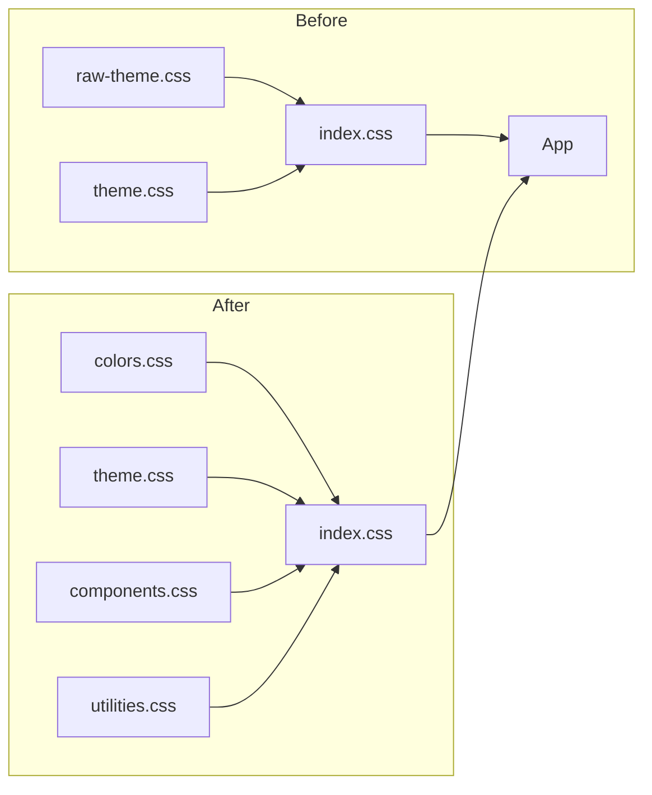

# Styles Refactor Plan - Hybrid Approach

## Current Issues

1. **Split color definitions** - Colors are defined in both [`raw-theme.css`](client/src/styles/color/raw-theme.css) and [`theme.css`](client/src/styles/color/theme.css)
2. **Duplicate dark theme overrides** - Dark theme styles exist in both files
3. **Multiple `@theme` blocks** - One in [`raw-theme.css`](client/src/styles/color/raw-theme.css:1) and another in [`index.css`](client/src/styles/index.css:10)
4. **Mixed concerns** - Terminal utilities live in theme file

## Proposed Hybrid Structure

```
client/src/styles/
├── index.css        # Entry point + imports + base styles
├── colors.css       # RAW color scales (primitive tokens)
├── theme.css        # Semantic mappings + fonts + dark theme
├── components.css   # Component styles (hero, buttons)
└── utilities.css    # Utility classes (terminal glow, cursor)
```

### Design Tokens Pattern

This structure follows the **Design Tokens** best practice:

| File         | Token Type | Purpose                                       |
| ------------ | ---------- | --------------------------------------------- |
| `colors.css` | Primitive  | Raw color values that NEVER change            |
| `theme.css`  | Semantic   | Contextual meanings that CAN change per theme |

### File Breakdown

#### 1. `colors.css` - Primitive Color Tokens

Raw color scales from [`raw-theme.css`](client/src/styles/color/raw-theme.css:6-116) - these NEVER change:

```css
/* ========================================
   PRIMITIVE COLOR TOKENS
   These are immutable - do NOT add semantic mappings here
   ======================================== */

@theme {
  --color-*: initial;

  /* --- Color Scales --- */
  --color-primary-50: oklch(0.95 0.05 260);
  --color-primary-100: oklch(0.9 0.1 260);
  /* ... all primary scale ... */

  --color-teal-50: oklch(98.4% 0.014 180.72);
  /* ... all teal scale ... */

  --color-ok-50: oklch(0.95 0.05 150);
  /* ... all ok scale ... */

  --color-warn-50: oklch(0.95 0.05 90);
  /* ... all warn scale ... */

  --color-fail-50: oklch(0.95 0.05 30);
  /* ... all fail scale ... */

  --color-fuchsia-50: oklch(97.7% 0.017 320.058);
  /* ... all fuchsia scale ... */

  --color-red-50: oklch(97.1% 0.013 17.38);
  /* ... all red scale ... */

  --color-neutral-50: oklch(0.985 0.001 106.423);
  /* ... all neutral scale ... */

  /* --- Brand Colors --- */
  --color-lagoon: oklch(0.72 0.11 221.19);
  --color-coral: oklch(0.7366 0.1672 40.7);
  --color-driftwood: oklch(0.79 0.06 74.59);
  --color-tide: oklch(0.49 0.08 205.88);
  --color-dusk: oklch(0.82 0.15 72.09);

  /* --- Avocado Scale --- */
  --color-avocado-100: oklch(0.99 0 0);
  /* ... all avocado scale ... */
}
```

#### 2. `theme.css` - Semantic Tokens + Dark Theme

Semantic mappings and theme definitions:

```css
/* ========================================
   SEMANTIC TOKENS - Light Theme Default
   ======================================== */

@theme {
  --color-scheme: light;

  /* --- Font Definitions --- */
  --font-display: "Playfair Display", serif;
  --font-sans: "Inter", ...;
  --font-mono: "JetBrains Mono", ...;
  --font-zodiak: "Zodiak", sans-serif;
  --font-dune: "Dune Rise", sans-serif;

  /* --- Light Theme Variables --- */
  --light-bg-body: var(--color-driftwood);
  --light-text-primary: oklch(0.428 0.0363 232.37);
  /* ... all light theme variables ... */

  /* --- Semantic Mappings (Light) --- */
  --color-heading: var(--color-lagoon);
  --color-text-primary: var(--light-text-primary);
  --color-bg-body: var(--light-bg-body);
  /* ... all semantic mappings ... */
}

/* ========================================
   DARK THEME OVERRIDES
   ======================================== */

@layer base {
  [data-theme="dark"] {
    --color-scheme: dark;

    /* Inverted color scales for dark theme */
    --color-neutral-50: oklch(0.147 0.004 49.25);
    /* ... all inverted scales ... */

    /* Dark theme variables */
    --dark-bg-primary: oklch(12.2% 0.05 38.18);
    --dark-text-primary: #e0e0e0;
    /* ... all dark theme variables ... */

    /* Semantic Mappings (Dark) */
    --color-heading: var(--color-dusk);
    --color-text-primary: var(--dark-text-primary);
    --color-bg-body: var(--dark-bg-primary);
    /* ... all dark semantic mappings ... */
  }
}
```

#### 3. `index.css` - Entry Point

```css
/* --- Font Imports --- */
@import url("https://fonts.googleapis.com/css2?family=Inter...");
@import url("https://fonts.googleapis.com/css2?family=JetBrains+Mono...");
@import url("https://api.fontshare.com/v2/css?f[]=zodiak...");
@import url("https://fonts.cdnfonts.com/css/dune-rise");

/* --- Core Imports --- */
@import "tailwindcss";
@import "./colors.css"; /* Primitive tokens - MUST come first */
@import "./theme.css"; /* Semantic tokens + dark theme */
@import "./components.css";
@import "./utilities.css";

/* --- Base Styles --- */
body {
  @apply leading-relaxed;
  background-color: var(--color-bg-body);
  /* ... */
}

:root {
  font-synthesis: none;
  /* ... */
}
```

#### 4. `components.css` - Component Classes

```css
/* ========================================
   COMPONENTS
   ======================================== */

@layer components {
  /* Hero Section */
  .hero {
    /* ... */
  }
  .hero__inner {
    /* ... */
  }
  .hero__title {
    /* ... */
  }

  /* Buttons */
  .prime-btn {
    /* ... */
  }
  .prime-btn--solid {
    /* ... */
  }
  .prime-btn--gradient {
    /* ... */
  }
}
```

#### 4. `utilities.css` - Utility Classes

```css
/* ========================================
   UTILITIES
   ======================================== */

@layer utilities {
  /* Terminal Effects */
  .terminal-glow {
    text-shadow:
      0 0 10px var(--color-lagoon),
      0 0 20px var(--color-lagoon),
      0 0 30px var(--color-lagoon);
  }

  /* Blinking cursor */
  @keyframes blink {
    0%,
    100% {
      opacity: 1;
    }
    50% {
      opacity: 0;
    }
  }

  .cursor-blink {
    animation: blink 0.8s step-end infinite;
  }
}

/* ========================================
   SCROLLBAR
   ======================================== */

::-webkit-scrollbar {
  display: none;
}

/* ========================================
   CUSTOM CURSOR
   ======================================== */

@media (pointer: fine) {
  body {
    cursor: none;
  }
  a,
  button,
  [role="button"],
  input,
  textarea,
  select {
    cursor: none;
  }
}

@media (pointer: coarse) {
  body,
  a,
  button,
  input,
  textarea,
  select {
    cursor: auto;
  }
}
```

## Migration Steps

1. **Create new `colors.css`** - Primitive tokens
   - Copy color scales from [`raw-theme.css`](client/src/styles/color/raw-theme.css:6-116)
   - Include: primary, teal, ok, warn, fail, fuchsia, red, neutral, avocado scales
   - Include: brand colors (lagoon, coral, driftwood, tide, dusk)

2. **Create new `theme.css`** - Semantic tokens
   - Add font definitions from [`index.css`](client/src/styles/index.css:10-23)
   - Add light theme variables from [`raw-theme.css`](client/src/styles/color/raw-theme.css:118-152)
   - Consolidate ALL dark theme overrides from both files

3. **Create new `components.css`**
   - Move component classes from [`index.css`](client/src/styles/index.css:49-151)

4. **Create new `utilities.css`**
   - Move terminal utilities from [`theme.css`](client/src/styles/color/theme.css:49-72)
   - Move cursor styles from [`index.css`](client/src/styles/index.css:173-206)
   - Move scrollbar styles from [`index.css`](client/src/styles/index.css:155-166)

5. **Update `index.css`**
   - Keep font imports at top
   - Update import paths to include all 3 new files
   - Keep only base body/root styles

6. **Delete old files**
   - Delete `client/src/styles/color/raw-theme.css`
   - Delete `client/src/styles/color/theme.css`
   - Delete `client/src/styles/color/` directory

## Benefits

| Aspect                | Before         | After              |
| --------------------- | -------------- | ------------------ |
| Primitive colors      | Mixed          | Separate file      |
| Semantic tokens       | Split          | Single file        |
| Dark theme overrides  | 2 files        | 1 file             |
| `@theme` blocks       | 2 separate     | 2 purpose-specific |
| Component styles      | Mixed in index | Dedicated file     |
| Design tokens pattern | No             | Yes                |

## Visual Comparison



## Files Changed

| File                         | Action                          |
| ---------------------------- | ------------------------------- |
| `styles/colors.css`          | Create - primitive color tokens |
| `styles/theme.css`           | Create - semantic tokens + dark |
| `styles/components.css`      | Create - extracted components   |
| `styles/utilities.css`       | Create - extracted utilities    |
| `styles/index.css`           | Update - simplified imports     |
| `styles/color/raw-theme.css` | Delete                          |
| `styles/color/theme.css`     | Delete                          |
| `styles/color/`              | Delete directory                |
